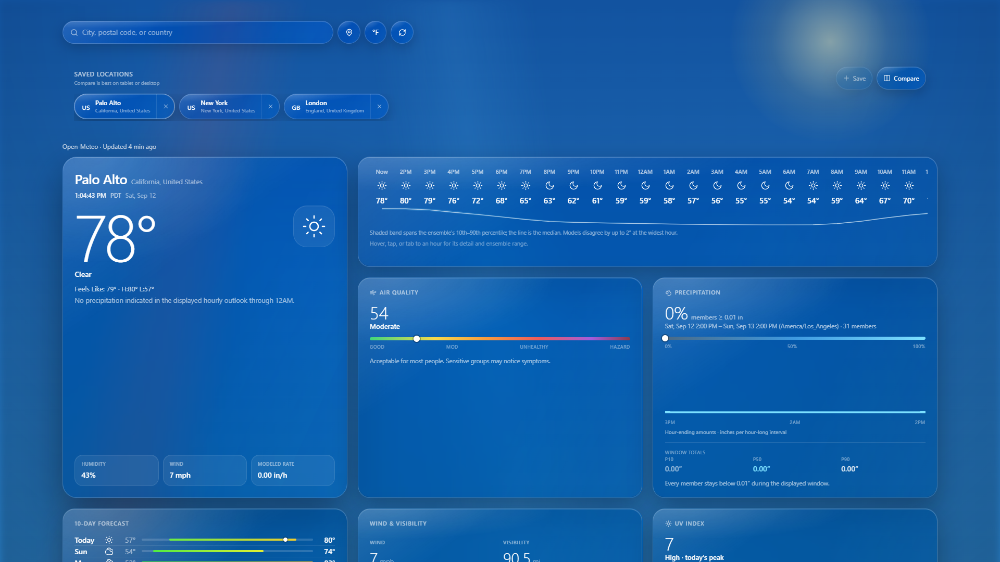
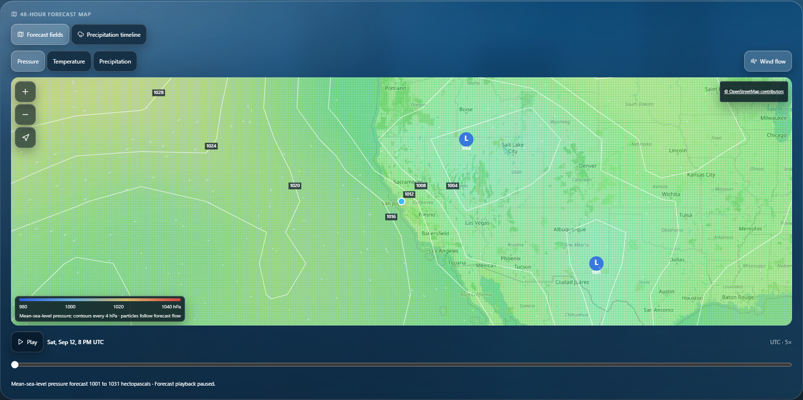
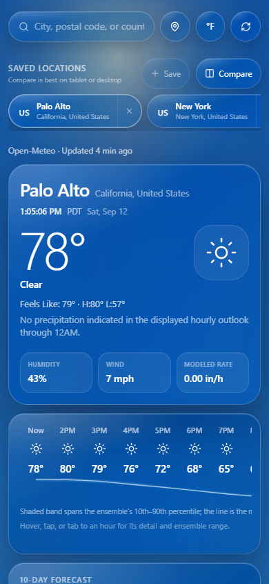

# Weather Dashboard

An ensemble-aware weather dashboard. Apple Weather's information density, with forecast
uncertainty treated as a first-class citizen rather than collapsed into a single number.

Runs entirely in the browser. **No API keys, no backend, no server-side secrets.**

## Current build and screenshots

The September 12, 2026 build includes the forecast-time, missing-data, verification,
and UI recovery corrections from [PR #10](https://github.com/Protonmatter/weather-dashboard/pull/10).
Application behavior is pinned to `eb1ae83`, which rotates bounded verification work so
unfillable older locations cannot repeatedly exclude later pending locations. `8eb002f`
added separate late transport-abort and canceled-response cache regressions. The package
version remains `0.2.0`; Git commits
identify these build updates. See [Build state](docs/BUILD_STATE.md) for artifact identity,
validation evidence, remaining limits, and the distinction between CI and deployment.

These are direct browser captures of the production build served locally, using live
Open-Meteo data for Palo Alto on September 12, 2026. They show the running application,
with its actual source labels and timestamps. Weather values will change between visits.

**Desktop overview — current conditions, the hourly ensemble band, and precipitation.**



**Forecast map — live GFS pressure fields with contours, wind, and a paused UTC timeline.**



**Phone layout — the same application at a 390 × 844 CSS-pixel viewport.**



[Capture provenance and reproduction steps](docs/screenshots/README.md) record the browser,
source commit, image hashes, and data conditions. The phone image is a responsive browser
capture, not a photograph or a claim of physical-device testing.

## What it does

- **Current conditions** — temperature, feels-like, daily high/low, condition summary
- **Location-local clock** — a live, seconds-resolution wall clock in the selected place's
  IANA timezone. Daylight-saving changes follow the place, not the viewer's computer. At
  local midnight, Rain today resets immediately and fresh point data is requested for the
  new day.
- **Consent-first local weather** — first visits show **Use my location** and **Not now**.
  The browser's native location prompt appears only after the first action is activated;
  denial, timeout, unsupported-browser, and unavailable-position states keep manual search
  and the Palo Alto live fallback usable.
- **Saved locations and comparison** — Palo Alto, New York, and London seed a removable,
  browser-local list. Save up to six places, switch the complete dashboard with one action,
  or open Compare for current conditions, location-local time, high/low, rain, humidity,
  UV, six hours, and three days. Compare is best on tablet or desktop, remains a stacked
  single-column experience on phones, and any card opens that place's full dashboard.
- **Inspectable weather details** — humidity, daily peak UV, estimated rain since local
  midnight, next-24-hour ensemble rain, wind, visibility, and pressure sit directly above
  the map. Hover or keyboard focus opens a compact tooltip; click, tap, or Enter pins the
  same expanded explanation, and Escape closes it.
- **24-hour strip** — hourly temperature and conditions, with an ensemble temperature band
  (p10–p90 with the median line) drawn beneath it. Shown only when a live ensemble is
  available — a synthetic fallback never fabricates the band. Hover, tap, or tab to any
  hour for its detail and exact ensemble range; click pins it.
- **10-day forecast** — gradient min/max range bars scaled to the week, with a "now" marker
  on today. Any day expands in place to its hourly detail, UV, and sun times — served from
  data already fetched, never a new request.
- **48-hour forecast map** — a keyless, client-side GFS view with mean-sea-level-pressure
  isobars and H/L centres, temperature and hour-ending precipitation layers, data-driven
  animated wind particles, and a play/pause UTC timeline. Playback advances the 48 already
  loaded hourly frames without another request; manual scrubbing pauses it. Reduced-motion
  users get static directional arrows and manual time control. Viewport grids are bounded
  to 63–117 samples and load only when the map approaches the screen; an active stationary
  grid revalidates when its 10-minute in-memory cache window expires. A pan, zoom, or Retry
  reports loading immediately while acquisition waits through a 400 ms debounce. Late
  canceled requests cannot clear a newer loading/error state or populate the grid cache.
- **Unified precipitation timeline** — the shared map preserves provider-native radar
  observations through an explicit `NOW` boundary, then continues into clearly labelled
  Open-Meteo GFS hour-ending precipitation for the next 24 hours (or 48 hours on demand).
  U.S. and territory observations use NOAA/NWS MRMS; other countries use RainViewer's public
  non-commercial feed. Observation and forecast overlays, legends, attribution, accessibility
  text, and failure states remain distinct. The timeline reuses the map's already-loaded GFS
  grid and does not issue a second forecast request. Radar code and network calls remain
  dormant until the timeline is selected; the catalogue revalidates every two minutes.
  Retained imagery is limited to the same live place/viewport context, is hidden while a new
  viewport settles, and is cleared when the provider reports an empty catalogue. Playback
  respects reduced-motion, offscreen, and background-tab pause states.
- **Precipitation (ensemble)** — p10–p90 fan chart with the median traced through it, plus
  accumulation quantiles over 24 complete future provider hours. The displayed window starts
  at the next provider-hour boundary; it excludes the partial hour already in progress.
  The headline percentage is the share of live members whose window total reaches 0.01″.
  Scrub the fan (pointer or arrow keys) to read each hour-ending amount and wet-member share.
- **Air quality, UV index, sunset arc**, humidity / wind / visibility / pressure
- **Backdrop reacts to conditions** — deterministic clear-day sun, clear-night stars,
  cloud, overcast, fog, snow, rain, and thunderstorm scenes. Rain density and speed scale
  from drizzle through heavy rain. Respects `prefers-reduced-motion`.

## Specification

Design decisions live in `docs/`, written before implementation:

- [Build state — current implementation, artifact identity, and validation](docs/BUILD_STATE.md)
- [RFC 0001 — Verification Depth, Delivery Pipeline, and Presentation Targets](docs/rfcs/0001-verification-and-delivery.md)
- [RFC 0002 — Temperature Verification Track](docs/rfcs/0002-temperature-verification.md)
- [RFC 0003 — Inspection and Drill-Down](docs/rfcs/0003-inspection-and-drill-down.md)
- [RFC 0004 — Interactive Forecast Map](docs/rfcs/0004-interactive-forecast-map.md)
- [RFC 0005 — Local Weather Context and Observed Radar](docs/rfcs/0005-local-context-and-radar.md)
- [RFC 0006 — Unified Precipitation Timeline](docs/rfcs/0006-unified-precipitation-timeline.md)
- [ADR 0002 — Defer WebGPU; ship a capability probe](docs/adr/0002-no-webgpu-yet.md)
- [Engineering handoff — data, archive, validation, and rollback contracts](docs/HANDOFF.md)

## Pipeline

Each job answers one question, so a red build says *what kind* of thing broke
before you open the log.

| Job | Question | When |
| --- | --- | --- |
| Static | Does it typecheck? | PR, main push, nightly, manual |
| Unit + regression | Is the math right, and did fixed defects stay fixed? | PR, main push, nightly, manual |
| Tooling regression (inside build) | Do smoke and dependency gates reject invalid results? | PR, main push, nightly, manual |
| Dependency | Any high/critical CVEs or licence drift? | PR, main push, nightly, manual |
| Build + budget + smoke | Does it build, fit the budget, and boot? | PR, main push, nightly, manual |
| Visual regression | Do inspected Chromium captures remain within the existing tolerances? | PR, main push, nightly, manual |
| Functional (E2E) | Do real journeys work in Chromium, WebKit, iPhone, Pixel? | PR, main push, nightly, manual |
| Contract | Do live provider schemas still match our parsers? | main + nightly; excluded from PR runs |
| Deploy | Does each host receive the tested artefact? | main push only |
| Post-deploy smoke | Did each configured host actually mount its entry chunk? | after deploy |

Contract and dependency jobs run nightly because provider schemas and CVE disclosures
happen on someone else's schedule. Contract tests are excluded from PR runs so an upstream
hiccup cannot block an unrelated contributor.

```bash
npm run typecheck   # static
npm test            # unit, validation, regression
npm run test:tooling # smoke and dependency gate regression tests
npm run contract    # live provider schemas — 11 tests, network required
npm run e2e         # all functional browser/device and visual projects
npm run smoke       # built artefact mounts in Chromium without runtime/module failures
npm run deps        # audit + licence allow-list
npm run size        # gzip budget
```

## Presentation targets

One codebase, three targets, selected by `matchMedia` — never user-agent sniffing.

| Target | Viewport | Treatment |
| --- | --- | --- |
| Phone | ≤767px | Single column, 44px minimum tap targets (WCAG 2.5.5), scroll-snap on the hourly strip |
| Tablet / laptop | All remaining viewports | Two-column auto-fit grid |
| Desktop 16:9 | ≥1600px and ≥16:10 | Denser panels, wider gutters, full-bleed presentation |

E2E asserts each: iPhone 15 and Pixel 7 viewports render without horizontal overflow, and
1920×1080 switches to the cinema layout.

**WebGPU is deliberately not used.** See [ADR 0002](docs/adr/0002-no-webgpu-yet.md):
the backdrop uses CSS/SVG with bounded scene particles, while map wind uses Canvas 2D.
`src/lib/gpu/capability.ts` is a retained capability helper with no current application
caller. A 50k-particle/60fps experiment remains a proposed decision criterion; it is not
a benchmark achieved by this build.

## Verification

The dashboard accumulates local forecast/reference pairs and displays verification
diagnostics. Live member values are sealed before their valid time; synthetic members are
excluded. Once an hour elapses, an Open-Meteo response retrieved after that hour can fill its
reference values. A full-day response cached before an hour ended cannot later become that
hour's reference just because the clock advances.

| Metric | Question it answers |
| --- | --- |
| **Brier score** | Are the stated probabilities accurate? |
| **Brier skill score** | Does it beat a constant forecast of this sample's event frequency? |
| **Murphy decomposition** | Is it miscalibrated (reliability) or merely uninformative (resolution)? |
| **Fair CRPS** | How close is the ensemble distribution to the reference, with a finite-ensemble adjustment? |
| **Reliability diagram** | Of every time it said 30%, did it happen 30% of the time? |
| **Rank histogram / rank PIT** | Where does the reference rank among members, allowing for ties and changing member counts? |
| **Spread–skill ratio** | How does corrected ensemble spread compare with ensemble-mean RMSE? |
| **Empirical CRPS and Hersbach decomposition** | How do reliability and potential add to ordinary empirical CRPS? |
| **Block bootstrap CI** | How much does temperature fair CRPS vary under this resampling procedure? |

The verification library also contains Diebold–Mariano, ROC/AUC, and ignorance-score
utilities. They are not displayed model-comparison results: this app does not archive a
rival forecast or establish that one model is significantly better than another.

The scoring conventions are explicit:

- **The decomposition reports its residual.** `BS = REL − RES + UNC` is exact only when
  bins group identical probabilities. Binning a continuous forecast leaves a within-bin
  variance/covariance term. It is reported rather than absorbed, because a decomposition
  that doesn't sum to the score it decomposes isn't one.
- **Fair and empirical CRPS are distinct.** The fair estimator uses `n(n−1)` in the
  member-pair term; the empirical score uses `n²`. Fairness relies on the sampling
  assumptions behind the estimator, not simply on having many members. Hersbach's
  reliability/potential split sums to empirical CRPS, which the temperature panel reports
  separately. For members `[60, 64]` and reference `62`, fair CRPS is `0 °F`, while empirical
  CRPS is `1 °F`. Differing member-count groups are decomposed separately and weighted by
  their sample counts, so none are silently dropped.
- **Ties share fractional rank mass.** If `k` members equal the reference, its weight is
  split equally across the `k+1` admissible ranks, including the reference itself. An
  all-dry case therefore spreads across every rank. Temperature uses normalized rank PIT;
  precipitation switches to it when member counts differ. This integrates the randomized
  rank distribution exactly into common bins, without random chart jitter. A flat expected
  histogram assumes exchangeability of members and the reference.
- **Spread–skill corrects each record before averaging.** With sample member variance
  `s²` and `n` members, the corrected spread is `sqrt(mean((n+1)/n × s²))`, divided by the
  ensemble-mean RMSE. The factor follows the sample-variance convention and is applied per
  record when `n` varies. Zero RMSE leaves the ratio undefined and displays an em dash.
- **Temperature confidence intervals use a moving-block bootstrap.** Records are ordered
  by valid time to retain some hourly dependence during resampling. The block length is a
  heuristic; irregular visits, mixed locations, model dependence, and reference error are
  not fully represented by this interval.

Scores below 100 samples are labelled provisional. Reaching 100 removes that display label;
it is not a test of statistical significance or evidence that the forecast is calibrated.

**The temperature ensemble is scored too** ([RFC 0002](docs/rfcs/0002-temperature-verification.md)).
The archive seals temperature members (°F, rounded to 0.1) at the same absolute valid
instants as precipitation. Missing reference precipitation and temperature stay pending
independently and can fill on different requests; finite zero is valid data. Already sealed
forecast members and already filled reference values are never replaced. Temperature can
be scored and displayed while precipitation references are still missing.

**Corrected archive series.** New records use `wx.verification.v2`. The application neither
reads nor rewrites `wx.verification.v1`, including when the new archive is cleared: earlier
records may contain shifted timestamps or missing values converted to zero, so silently
rescoring them would mix incompatible evidence. The `issued` field is this device's
retrieval/sealing time, not an inferred model initialization time. New records retain a
source identifier, precipitation interval start, and the original response retrieval time
for each filled variable. Malformed numeric records are excluded at the storage boundary.

**Bounded reconciliation.** Each pass attempts at most five distinct pending locations in
sorted, rotating order. A separate browser-local cursor remembers the last scheduled
location, so missing or failed references do not monopolize every pass. Successful cursor
writes preserve progress across reloads; unavailable storage retains progress only in the
current session. The five-location limit applies to each pass, not all tabs collectively.
Reference requests still use `past_days=14`; the app does not discard an otherwise eligible
returned reference solely because it is older than exactly fourteen elapsed days.

**Limitations, stated plainly.** Open-Meteo's forecast endpoint with `past_days` supplies
elapsed operational model values; these are not station measurements or an independent
reanalysis validation. Scores reflect one browser's visited places and hours. They do not
establish empirical calibration, provide a calibrated probability product, or measure skill
against an independent climatological baseline.

## Data sources

Every source is keyless and CORS-enabled, which is why this needs no backend.

| Source | Used for |
| --- | --- |
| [Open-Meteo Forecast](https://open-meteo.com/) | Current conditions, hourly, 10-day, UV, sunrise/sunset |
| [Open-Meteo GFS](https://open-meteo.com/en/docs/gfs-api) | Bounded 48-hour map grids and the modeled future timeline segment: temperature, mean-sea-level pressure, precipitation, and wind |
| [Open-Meteo Ensemble](https://open-meteo.com/en/docs/ensemble-api) | GFS ensemble members for the precipitation fan, the temperature band, and temperature verification |
| [Open-Meteo Air Quality](https://open-meteo.com/en/docs/air-quality-api) | US AQI |
| [Open-Meteo Geocoding](https://open-meteo.com/en/docs/geocoding-api) | City search, population-ranked |
| [Zippopotam.us](https://api.zippopotam.us/) | Exact postal code lookup (~60 countries) |
| [Photon](https://photon.komoot.io/) (Komoot / OSM) | Postcodes, addresses, villages, landmarks |
| [BigDataCloud](https://www.bigdatacloud.com/) | Reverse geocoding for "use my location" |
| [OpenStreetMap standard tiles](https://operations.osmfoundation.org/policies/tiles/) | Interactive map base layer; visible tiles only, no prefetch or proxy |
| [NOAA/NWS MRMS](https://mapservices.weather.noaa.gov/eventdriven/rest/services/radar/radar_base_reflectivity_time/ImageServer) | Recent base-reflectivity radar frames for U.S. and territory locations |
| [RainViewer public maps](https://www.rainviewer.com/api/weather-maps-api.html) | Recent radar tiles outside the U.S.; non-commercial use only, maximum zoom 7 |

Photon and Zippopotam are OpenStreetMap-derived. **ODbL attribution is required** if you
deploy this publicly — see [openstreetmap.org/copyright](https://www.openstreetmap.org/copyright).
The map also renders visible attribution directly over its tile layer.

Radar provider selection is deterministic from the selected place's ISO country code:
`US`, `PR`, `VI`, `GU`, and `MP` use NOAA MRMS; all other codes use RainViewer. There is no
silent fallback from NOAA to a global provider, so an outage cannot quietly change source
or terms. If the country code cannot be determined, radar fails closed as unavailable instead
of silently assigning RainViewer. RainViewer attribution remains visible in the radar detail area. A blank radar
layer can mean either no precipitation or no provider coverage; the UI says so rather than
claiming a clear sky. Image delivery failures are reported separately and are never described
as valid blank coverage.

The precipitation timeline is deliberately not a simulated-radar product. Its left segment is
observed reflectivity from the selected radar provider; its right segment is Open-Meteo GFS
hour-ending modeled precipitation. The source badge, timestamp, legend, attribution, renderer,
and accessible value text all switch at `NOW`. A provider failure disables only its own segment:
radar failure leaves modeled precipitation usable, and GFS failure leaves observations usable.

"Rain today" sums Open-Meteo's 15-minute liquid rain and shower estimates through the current
provider timestamp in the selected place's local calendar day. The 26-hour lookback covers
DST-length days; snowfall is excluded. Point forecasts are not served from the short shared
HTTP cache, so a local-midnight refresh cannot reuse a pre-midnight response. It is not a
physical rain-gauge observation.
Missing optional UV and visibility are shown as unavailable while the rest of the forecast
remains usable; no advice is generated from a missing value, and finite zero is preserved.
"Next 24h precip" is the ensemble total-precipitation median over the displayed complete
provider-hour window, which can include snow water equivalent, and its expanded panel reports
p10–p90. A request at 10:20 with whole-hour provider boundaries covers 11:00 through 11:00
the next day, using the 24 amounts ending at 12:00 through 11:00. Provider Unix axes may have
fractional UTC-hour phases: Kolkata uses `:30` and Chatham `:15` in the checked responses.
The window follows those actual instants instead of rounding to UTC whole hours.

Opening the map sends its bounded coordinate grid to Open-Meteo and requests the visible
tile range from the configured tile provider. Map grids are held only in a four-entry
memory cache and are never written to the verification archive or `localStorage`.

Comparison uses a separate, bounded Open-Meteo point-summary request for each saved place,
with at most two requests active at once. It never requests ensemble, AQI, map, NOAA MRMS,
or RainViewer data. Successful summaries remain in memory for ten minutes and revalidate
when Compare reopens; failures stay within the affected card.

## Location privacy and storage

Geolocation is requested only after **Use my location** is activated. The resulting
coordinates are sent to BigDataCloud for optional reverse geocoding and to Open-Meteo for
weather. A detected or searched place is never saved automatically: **Save current
location** is always explicit.

Saved place metadata stays in this browser under `wx.saved-locations.v1`; the first-run
decision is stored separately under `wx.location-onboarding.v1`. Weather responses and
coordinates are not sent to an application backend, and there is no account, cookie,
cross-device synchronization, or telemetry. Selecting **Precipitation timeline** requests the visible
map area under the provider policy described above. Clearing site data removes the saved
list and onboarding choice; older app versions safely ignore both versioned keys.

The verification archive is also browser-local, under `wx.verification.v2`. It holds rounded
location coordinates, member arrays, valid times, and reference/provenance values, retaining
up to 4,000 records from the last 30 days. An existing `wx.verification.v1` is left untouched
and still occupies storage. `wx.verification.cursor.v1` stores one last-scheduled location
key separately from sealed forecast evidence. Clearing site data removes all three keys;
the verification clear action resets the session cursor and removes v2 and its persisted
cursor when storage permits, leaving legacy v1 untouched. Storage denial or quota exhaustion
can prevent new scores and cursor progress from persisting while weather display continues
to work. There is no automatic legacy migration or cross-tab scheduling lock.

## Search

`parseQuery` inspects the input shape before dispatching, so one field handles everything:

| Input | Behaviour |
| --- | --- |
| `Tokyo` | City search, population-ranked |
| `94301` | Postal lookup; ambiguous 5-digit shapes are queried across US/DE/FR/ES/IT |
| `10115 Germany` | Trailing country token strips off and constrains results |
| `SW1A 1AA UK` | UK postcode shape matched by regex |
| `35.68, 139.69` | Coordinates resolved directly, no network call |

Results from all sources are de-duplicated on a ~1 km grid (lat/lon to 2dp), merged field-wise,
and ranked exact-postal-first then by population. Type-ahead is debounced at 350 ms.

## Ensemble handling

`fetchEnsemble` requests GFS members from Open-Meteo and `ensembleStats` computes quantiles
with linear interpolation between order statistics. Only finite member rows covering all 24
precipitation endpoints are retained, with at least three required for a live result. A missing
amount is never filled as dry weather. Temperature is optional: its archived rows match the
precipitation endpoints, while its display band matches the instantaneous hourly-strip axis.
An unavailable temperature set does not invalidate a complete precipitation ensemble.

The point and ensemble requests share a reference instant. `precipitationWindow` selects 24
complete future intervals using the provider axis's actual UTC phase, and publishes
`windowStart`, `windowEnd`, and hour-ending `validTimes`. Totals, chart labels, and archival
records use that same window rather than assuming point-array positions are interchangeable.

If the live ensemble is unavailable or incomplete, `synthMembers` can generate deterministic
illustrative members from a complete set of point precipitation probabilities on that window.
Their amount scale and spread are heuristic: their quantiles and member shares are not
calibrated uncertainty, observed frequencies, or additional model runs. The UI distinguishes
this modeled fallback from live GFS members. It supplies no temperature band and contributes
nothing to verification. If the required point probabilities are also missing, spread is
unavailable rather than synthesized from zeros. Caller cancellation propagates; a provider
timeout remains an availability failure that may use this fallback.

`ensembleFor` is the provider seam. Adding another model requires an explicit agreement on
units, valid intervals, missingness, provenance, and member dependence before combining
distributions. Concatenating unrelated member arrays alone does not establish a valid or
calibrated multi-model ensemble.

## Architecture

```
src/
  lib/
    http.ts          abort, timeout, backoff, circuit breaking, TTL cache
    query.ts         query shape classification (city / postal / coords)
    search.ts        provider fan-out, merge, de-duplication, ranking
    ensemble.ts      quantiles and ensemble summarisation
    map/             Web Mercator, grids, contours, H/L detection, rendering state
    precipitation/   unified observation/forecast timeline and presentation contracts
    radar/           NOAA/RainViewer selection, schema validation, bounded image URLs
    weather.ts       forecast assembly; ensembleFor() is the provider seam
    locations/       validated browser-local saved-place persistence
    comparison/      bounded point summaries and two-slot request scheduler
    verification/
      metrics.ts     Brier, Murphy decomposition, CRPS, rank histogram
      advanced.ts    spread–skill, Hersbach split, PIT, bootstrap, Diebold–Mariano
      store.ts       localStorage forecast archive, sealed before outcomes
      verify.ts      elapsed model-reference reconciliation and scorecard assembly
    units.ts         conversion, colour ramp, formatting
    wmo.ts           WMO 4677 code decoding
    providers/       one adapter per external service, typed at the boundary
  hooks/             search, comparison, forecast-map, precipitation, and radar request lifecycles
  components/        dashboard UI, inspection, rendering, and verification orchestration
```

Provider JSON requests use `lib/http.ts`. Request owners abort superseded work, and the
helper distinguishes caller cancellation from internal timeouts. It retries network,
server, and rate-limit failures, opens a circuit after repeated provider failures, and uses
short per-call caches. Expected non-retryable 4xx responses do not trip the circuit. Map
and radar tile images use the browser's image-loading lifecycle separately.

`hooks/useSearch.ts` carries two independent guards against out-of-order resolution: the
previous request is aborted when a new one starts, and a monotonic sequence number gates
the `setState`. Abort alone is insufficient — an in-flight response can still resolve — so
the sequence check is what actually guarantees only the newest query writes to state.

`hooks/useForecastMap.ts` also starts pending feedback before debounce, aborts superseded
transports, and rejects obsolete success before writing its cache. The map reducer ignores
older request generations, including a delayed abort arriving after a newer failure.

## Running locally

```bash
npm ci
npm run dev
```

CI uses Node 20; local validation also ran on Node 24.18.0. The lockfile is the dependency
authority. For a production-build preview, run `npm run build` and then `npm run preview`.
Browser checks additionally require `npx playwright install chromium webkit` (Linux CI uses
`--with-deps`). The [build record](docs/BUILD_STATE.md) separates local platform results
from hosted checks.

Optional map provider settings are documented in `.env.example`. The default calls
Open-Meteo directly and uses OpenStreetMap standard raster tiles. A configured
`VITE_MAP_FORECAST_BASE_URL` must expose an Open-Meteo-compatible `/v1/gfs` path; transient
proxy failure falls back to the direct provider. Tile and weather endpoint values are
build-time configuration, never search-box input.

## Development checks

```bash
npm run typecheck   # tsc --noEmit, strict + noUncheckedIndexedAccess
npm test            # unit, validation, regression
npm run test:tooling # Node tests of delivery gate failure paths
npm run build
npm run size        # initial JS ≤73 KiB; total JS ≤105 KiB gzip
```

CI runs these checks on pull requests and pushes to `main`, as well as scheduled and manual
runs. The total JavaScript ceiling was
revised from 99 to 105 KiB for the review's correctness and failure-state handling; the
73 KiB initial-load ceiling is unchanged. No dependency was added for these fixes.

`npm run smoke` launches Chromium against the production build and requires the application
to mount without runtime or module failures. `npm run deps` fails closed when dependency
audit or licence evidence is unavailable or malformed. In CI, E2E downloads and serves the
same `dist` artifact that the build job budgeted and smoke-tested; it does not rebuild it.

Tests cover the parts where being wrong is silent: quantile interpolation against known
type-7 values, ensemble threshold semantics, postal-shape classification including the
ambiguous 5-digit case, abort and retry policy, circuit-breaker behaviour, and the
de-duplication merge, and every verification metric against hand-computed analytic
values — CRPS reducing to absolute error for a single member, the decomposition identity
reconstructing the Brier score, and the rank histogram's tie handling.
Regression cases also cover Unix-time alignment in UTC and fractional-offset locations,
complete hour-ending precipitation windows, missing reference values that later become
available, independent temperature backfill, cached values fetched before their valid time,
legacy archive retention, changing member counts, an exact exchangeable ±1 spread–skill
population, and the separate fair/empirical CRPS identities.
Reconciliation regressions cover rotation past missing, unavailable, and failed locations,
reload persistence, session progress when writes fail, five distinct locations per pass,
wraparound, pre-aborted calls, cursor clearing, and eligible returned references older than
fourteen elapsed days. The `eb1ae83` unit/component suite passed 418 tests; live contracts
remain a separate run. [Build state](docs/BUILD_STATE.md) distinguishes this local evidence
from the final PR commit's hosted checks.
The map suite additionally covers projection round-trips and the antimeridian, adaptive
grid bounds, missing-data interpolation, marching-squares saddles, H/L suppression,
provider schema and unit drift, timeout-versus-cancellation fallback, bounded cache
freshness, responsive height changes, lazy-chunk containment, stale request generations,
stationary-grid revalidation, stable tile identity while panning, polar viewport bounds,
touch-sized error recovery and attribution, isolated optional-map circuit breaking, and
retry recovery for a failed viewport. Wheel-input coverage verifies coalesced zoom while
preventing document scroll, and responsive tests preserve pan and forecast-time state.
Separate transport regressions release an old AbortError during replacement debounce,
during its transport, and after its failure; a canceled-success case checks both displayed
grid identity and a fresh acquisition when revisiting the obsolete viewport. These use
controlled responses through the real HTTP/provider/hook/reducer/UI chain. All four cases
passed on all four browser projects; deliberate guard-removal controls verified their
ability to detect the intended regressions. See [the handoff](docs/HANDOFF.md) for commands.
Pressure-extrema tests preserve missing cells and keep nearby opposite H/L systems while
still suppressing duplicate labels of the same kind.
Wind-flow tests interpolate vector components across the north-bearing wrap, fail closed on
missing samples, and verify deterministic bounded particle budgets. Browser journeys also
verify forecast playback does not refetch, reduced-motion fallback stays manual, and the
decision summary precedes the exploratory map.

## Deploying

The build output is static with a relative base (`base: "./"`), so the same artefact
can be served from a domain root or subpath. Hosting quotas and provider terms still apply.

**GitHub Pages** — deployed automatically by `.github/workflows/ci.yml` on every push to
`main` after the build, dependency, functional, and visual gates pass (enable Pages in
repo settings with source *GitHub Actions* once). The configured URL is
[GitHub Pages](https://protonmatter.github.io/weather-dashboard/). A green PR run or a local
README screenshot does not establish that this URL serves the new commit; verify the main
deployment and its post-deploy smoke in [GitHub Actions](https://github.com/Protonmatter/weather-dashboard/actions/workflows/ci.yml).

**Cloudflare Pages** — the same workflow carries a `deploy-cloudflare` job that skips
itself until two repository secrets exist:

```bash
gh secret set CLOUDFLARE_API_TOKEN    # API token with Cloudflare Pages: Edit
gh secret set CLOUDFLARE_ACCOUNT_ID   # dash.cloudflare.com → Workers & Pages → account ID
```

The job creates the Pages project on first run, deploys the exact `dist` artefact already
built, budgeted, smoke-tested, and exercised by E2E, then independently runs the browser
startup smoke against the Cloudflare URL. The Linux-only deployment step pins an exact Wrangler version and
its compatible Node 22 runtime; Wrangler is deliberately not a dev dependency because its
`workerd` binary does not support Windows ARM64. Connecting the repo in the Cloudflare
dashboard is intentionally avoided
because that would build outside these gates. The isolated project name is
`protonmatter-weather-dashboard`, yielding
<https://protonmatter-weather-dashboard.pages.dev/> after first activation.

**Other static hosts** — publish the verified `dist/` directory and validate its asset paths
and browser startup. This repository does not include Netlify/Vercel deployment jobs or
evidence that those hosts have deployed the current build.

## Rate limits worth knowing

- Open-Meteo free access: 600 calls/minute, 5,000/hour, 10,000/day, and 300,000/month for
  non-commercial use, with no uptime guarantee; request complexity can count as multiple
  calls. [Provider pricing and limits](https://open-meteo.com/en/pricing), checked September 12, 2026.
- Photon: free community service, no published SLA
- OpenStreetMap standard tiles: visible attribution, normal browser caching and referrer
  behavior, no bulk/offline prefetch, and no availability guarantee.
  [Tile usage policy](https://operations.osmfoundation.org/policies/tiles/).
- RainViewer public weather maps: non-commercial use only, maximum zoom 7, recent past
  observations only, and no availability guarantee. The [API documentation](https://www.rainviewer.com/api/weather-maps-api.html)
  specifies frame-generation timestamps; a composite can contain observations from different times.
- NOAA MRMS: public operational service for supported U.S. areas; availability and frame
  cadence are provider-controlled

These defaults are suitable only for bounded, non-commercial traffic. Commercial
Open-Meteo use requires an appropriate licence. Under real load, put a caching proxy in
front of weather requests only — never the OpenStreetMap standard tile service. RFC 0004
keeps the weather base URL pluggable, while a production Worker remains a separate design
and security change.

## License

MIT
